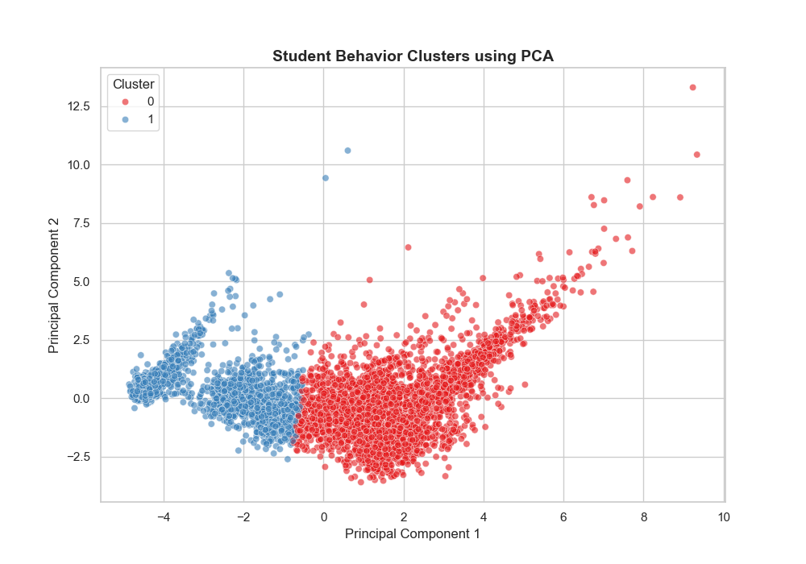
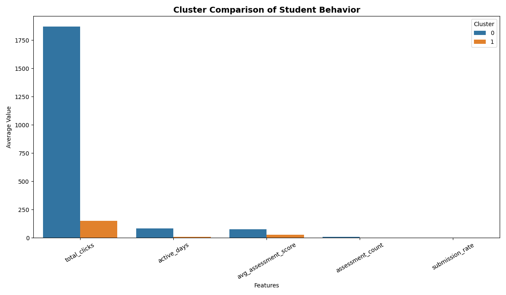
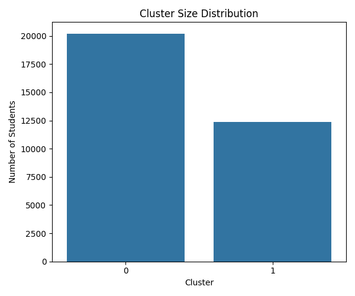
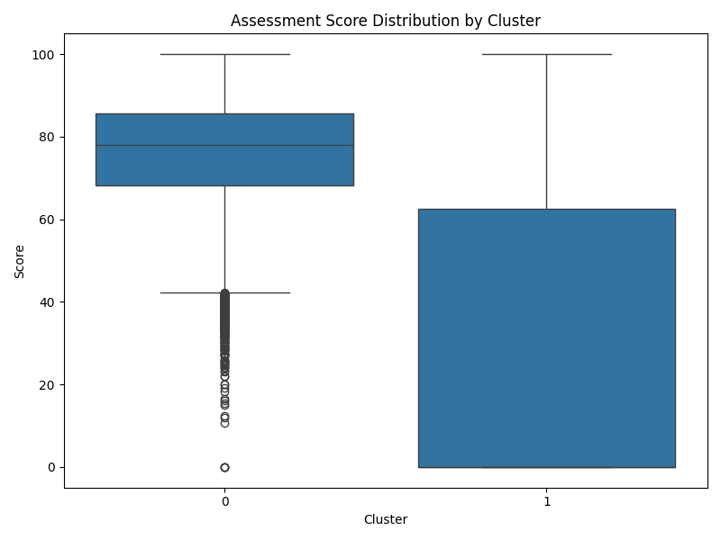
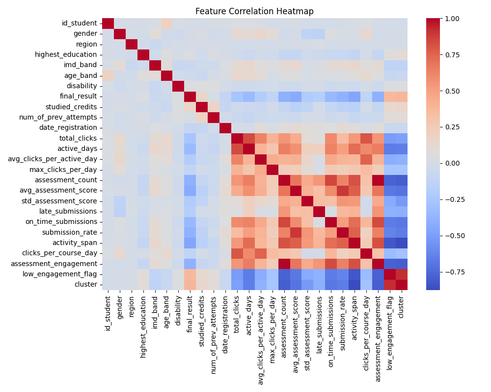

# Student Behavior Clustering using Unsupervised Learning


---

## Overview

This project applies **unsupervised machine learning** techniques to analyze student behavior using the **Open University Learning Analytics Dataset (OULAD)**.

The goal is to uncover hidden patterns in student engagement and automatically group students into meaningful clusters—without using predefined labels.

---

## Problem Statement

Educational institutions often struggle to identify **at-risk students early**.

This project answers:

> *Can we detect struggling students purely from their behavior patterns—without using performance labels?*

---

## Solution Approach

* Built a complete **data pipeline** to merge multiple relational datasets
* Engineered behavioral features like engagement, activity, and performance indicators
* Applied **K-Means clustering** on normalized data
* Used **Silhouette Score** to determine optimal clusters
* Reduced dimensions using **PCA** for visualization

---

## Project Structure

```id="p9l2x1"
oulad_student_behavior_clustering/
│
├── data/
│   ├── raw/
│   ├── interim/
│   └── processed/
│
├── figures/
│   ├── pca_cluster_plot.png
│   ├── cluster_comparison.png
│   ├── correlation_heatmap.png
│   ├── cluster_size.png
│   └── score_distribution.png
│
├── reports/
│   ├── abstract.md
│   └── findings.md
│
├── src/
│   ├── data_pipeline.py
│   ├── clustering.py
│   ├── analyze_clusters.py
│   ├── visualization scripts...
│
├── requirements.txt
└── README.md
```

---

## Installation

```id="3hl8wq"
git clone https://github.com/your-username/oulad-student-clustering.git
cd oulad-student-clustering

python -m venv venv
venv\Scripts\activate

pip install -r requirements.txt
```

---

## How to Run

### 1️. Data Pipeline

```id="mq3l6m"
python src/data_pipeline.py
```

### 2️. Clustering

```id="b8v9js"
python src/clustering.py
```

### 3️. Analysis

```id="9p1gql"
python src/analyze_clusters.py
```

### 4️. Visualizations

```id="y4m8zd"
python src/visualize_clusters.py
python src/visualize_comparison.py
```

---

## Key Results

### Optimal Clusters: **2**

---

### Cluster 0 — High Engagement Students

* High activity (~1869 clicks)
* Regular participation (~83 days)
* Strong performance (~76 score)

**Consistent High Achievers**

---

### Cluster 1 — At-Risk Students

* Low activity (~148 clicks)
* Minimal participation (~9 days)
* Poor performance (~28 score)

**Disengaged Learners**

---

## Visual Insights

### PCA Cluster Visualization



---

### Feature Comparison Across Clusters



---

### Cluster Size Distribution



---

### Score Distribution



---

### Correlation Heatmap



---

## Key Insights

* Engagement strongly correlates with academic performance
* Students naturally separate into **high-performing vs at-risk groups**
* Behavioral data alone is enough to detect struggling students
* Unsupervised learning can uncover actionable educational insights

---

## Real-World Applications

* Early warning systems for at-risk students
* Personalized learning recommendations
* Improved course design strategies
* Data-driven academic interventions

---

## Tech Stack

* **Python**
* **Pandas, NumPy**
* **Scikit-learn**
* **Matplotlib, Seaborn**

---

## Future Improvements

* Apply DBSCAN / Hierarchical clustering
* Build predictive models (supervised learning)
* Deploy dashboard using Streamlit
* Real-time student monitoring system

---

## Author

**Vishnu Vardhan**

---

## License

This project is licensed under the MIT License.
